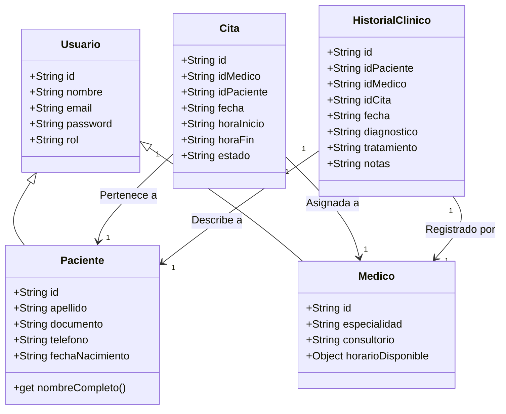
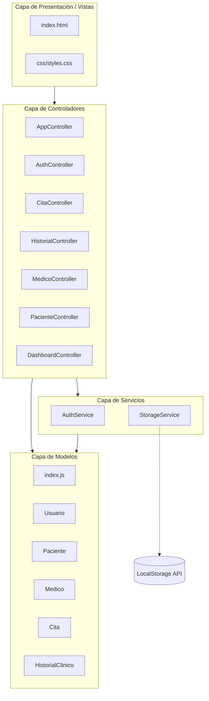
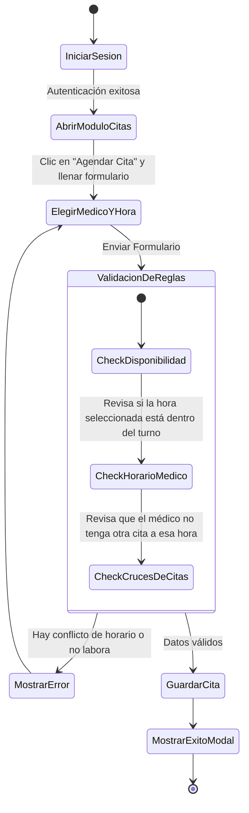
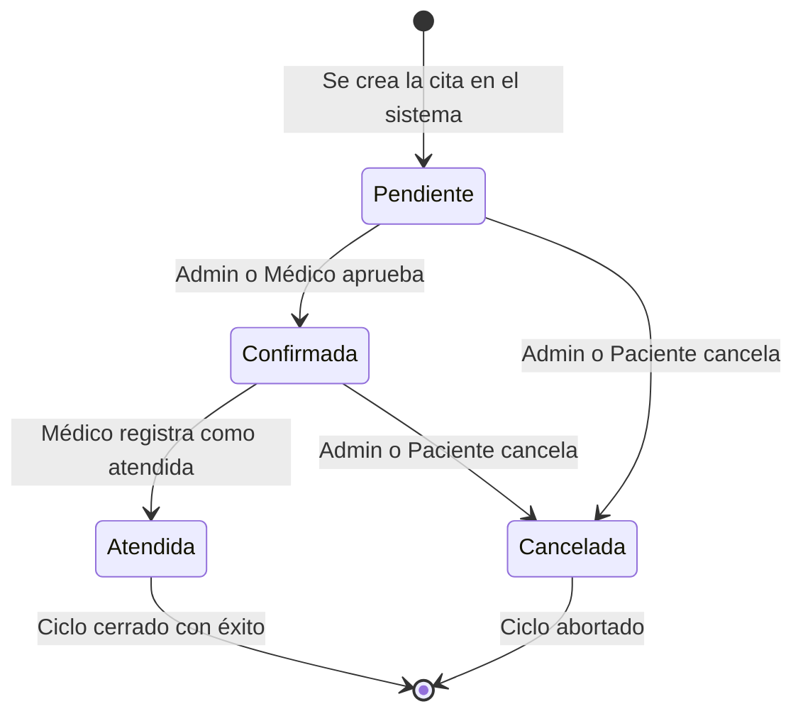
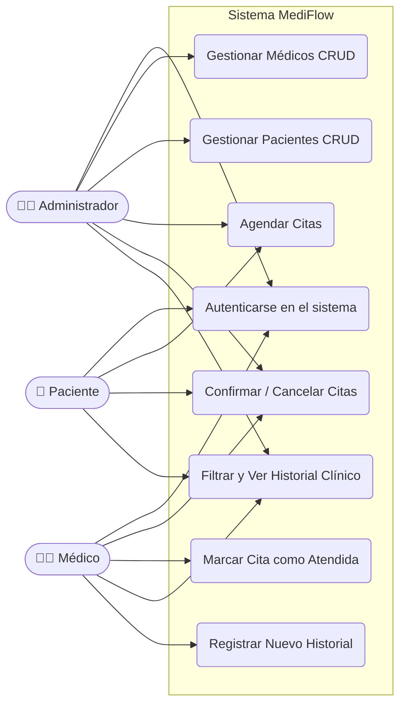
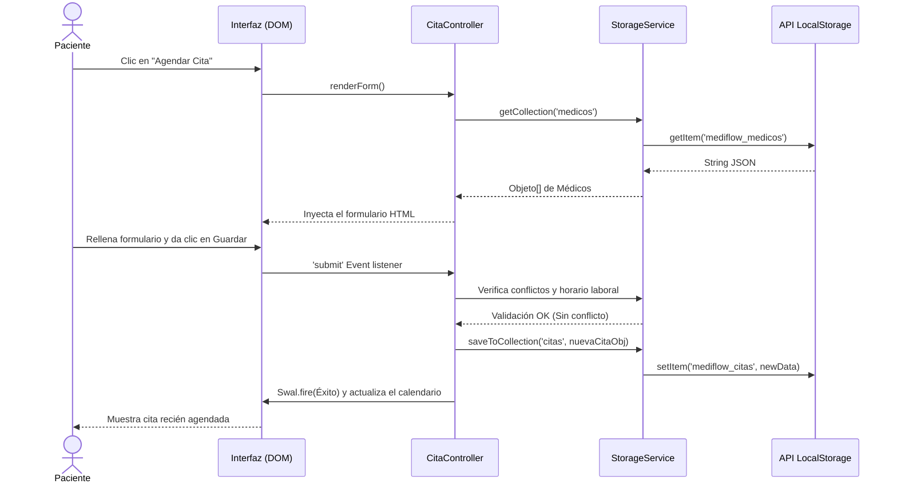

# Diagramas UML - Proyecto Clínica (MediFlow)

A continuación, se presentan los diagramas UML solicitados, basados estrictamente en el código y la arquitectura actual del proyecto (MVC Vanilla JavaScript + LocalStorage).

## 1. Diagrama de Clases
Muestra la estructura de los modelos principales y sus herencias.



---

## 2. Diagrama de Objetos
Ejemplifica instancias reales del sistema interactuando en un momento determinado.

```mermaid
classDiagram
    class JuanPerez {
        id: "P001"
        nombre: "Juan"
        apellido: "Pérez"
        documento: "123456789"
        telefono: "3001234567"
        email: "juan@mail.com"
        rol: "paciente"
    }
    class DrCarlosMartinez {
        id: "M001"
        nombre: "Carlos Martínez"
        especialidad: "Cardiología"
        consultorio: "101A"
        email: "carlos@mediflow.com"
        rol: "medico"
        horarioDisponible: { inicio: "08:00", fin: "17:00" }
    }
    class CitaCardiologia {
        id: "C001"
        idMedico: "M001"
        idPaciente: "P001"
        fecha: "2026-06-15"
        horaInicio: "10:00"
        horaFin: "10:20"
        estado: "confirmada"
    }
    
    CitaCardiologia --> JuanPerez : Referencia a paciente
    CitaCardiologia --> DrCarlosMartinez : Referencia a médico
```

---

## 3. Diagrama de Paquetes
Muestra la arquitectura en capas (Vistas, Controladores, Servicios y Modelos).



---

## 4. Diagrama de Actividades
Representa el flujo de trabajo al **Agendar una Cita**.



---

## 5. Diagrama de Estados
Muestra el ciclo de vida de una **Cita Médica**.



---

## 6. Diagrama de Casos de Uso
Expone cómo los diferentes actores (roles) interactúan con los módulos del sistema.



---

## 7. Diagrama de Secuencia
Ilustra los pasos y llamados a métodos al momento de **Agendar y Guardar una Cita**.


